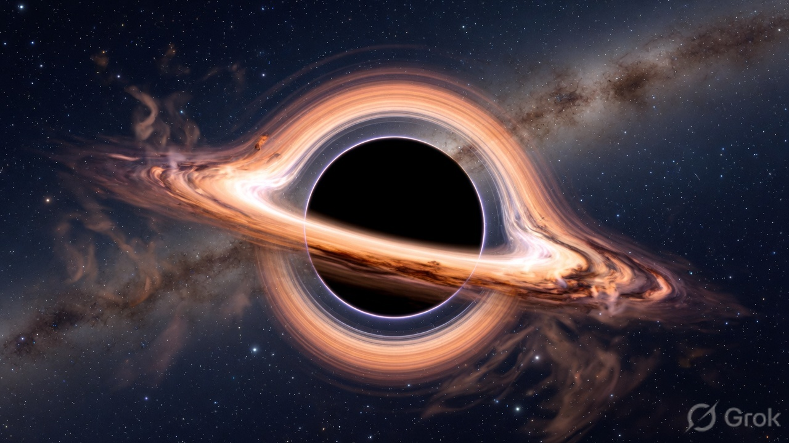
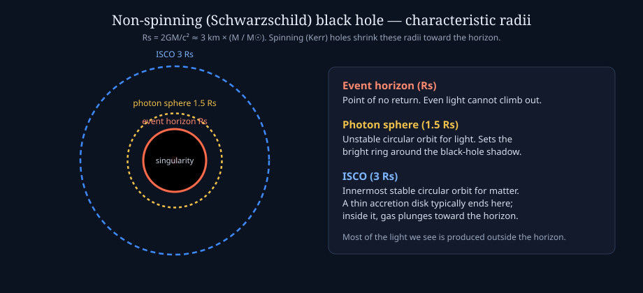

# Black holes

A **black hole** is a region of spacetime where gravity is so strong that nothing — including light — can escape from inside a surface called the **event horizon**. The object we “see” in pictures is never the interior. It is glowing gas, lensed light, and shadows *outside* that surface.

*Teaching illustration: dark silhouette, bright accretion flow, and a lensed image of the far side of the disk wrapping over the hole. Not an observation.*

## Why “black”?

Escape speed from a mass $M$ of radius $R$ is $v_\mathrm{esc} = \sqrt{2GM/R}$. Set $v_\mathrm{esc} = c$ and you get the **Schwarzschild radius**

$$
R_\mathrm{s} = \frac{2GM}{c^2} \approx 3\,\mathrm{km}\times\left(\frac{M}{M_\odot}\right).
$$

Compress the Sun to ~3 km, or Earth to ~9 mm, and the event horizon would sit at that radius. The matter that formed the hole is not sitting on a hard surface; in classical general relativity it has collapsed toward a **singularity** (a breakdown of the classical description). Astrophysics almost never needs the singularity — observations probe the horizon-scale *exterior*.

## A few radii that matter

For a **non-spinning** hole (Schwarzschild):

| Radius | Value | Role |
|--------|-------|------|
| Event horizon | $R_\mathrm{s}$ | No return |
| Photon sphere | $1.5\,R_\mathrm{s}$ | Unstable light orbit; sets the bright ring / shadow edge |
| ISCO | $3\,R_\mathrm{s}$ | Innermost stable circular orbit for matter; inner edge of a thin disk |

Spinning (**Kerr**) holes pull the horizon, photon orbit, and ISCO inward. That is why **spin** changes the disk’s inner temperature and the X-ray spectrum.

## Two mass scales

| Kind | Typical mass | How they form (sketch) |
|------|----------------|-------------------------|
| **Stellar-mass** | ~5–50 $M_\odot$ (heavier ones exist) | Collapse of a massive star, or mergers |
| **Supermassive (SMBH)** | $10^6$–$10^{10}\,M_\odot$ | Growth by accretion and mergers in galaxy centers |

Examples: **Sgr A\*** in the Milky Way is ~4 million $M_\odot$. **M87\*** is several billion $M_\odot$. Quasar engines sit in this supermassive range, often $10^8$–$10^9\,M_\odot$ or more.

Stellar-mass disks run hotter (~keV, X-rays). Supermassive disks are larger and cooler at a given Eddington ratio; their thermal peak is UV/optical, with X-rays from a **corona** above the disk.

## Accretion: how a black hole shines

Gas rarely falls straight in. It has angular momentum, so it forms a rotating **accretion disk**. Viscosity (in real disks, magnetic turbulence) lets gas spiral inward. Gravitational energy becomes heat. Roughly **~10% of $\dot{M}c^2$** can be radiated — more efficient than nuclear fusion.

That light is produced **outside** the horizon. Material that crosses the horizon does not send a last postcard.

If magnetic fields thread the inner disk and spinning hole, some energy and particles are launched as **jets** along the spin axis.

## What this has to do with quasars

A quiet SMBH (Sgr A\* today) is dim. Feed the same kind of object a large $\dot{M}$ and the disk + corona become a lighthouse: an [active galactic nucleus](quasars.md), of which a **quasar** is the high-luminosity end.

Continue: [Quasars](quasars.md) · [X-ray astronomy](x-ray-astronomy.md) · [Glossary](glossary.md)
