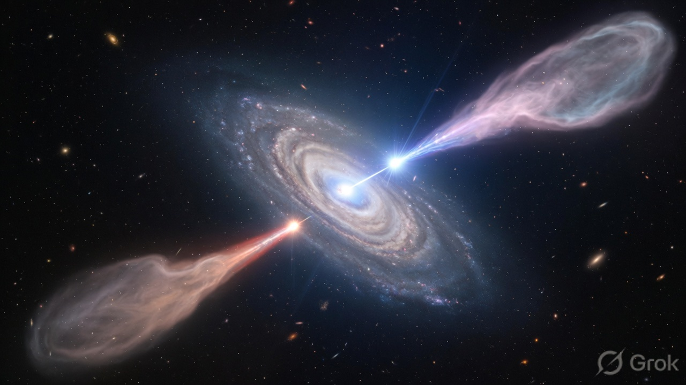
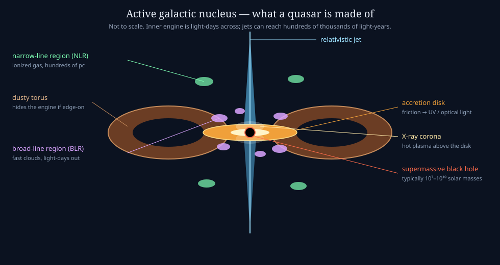
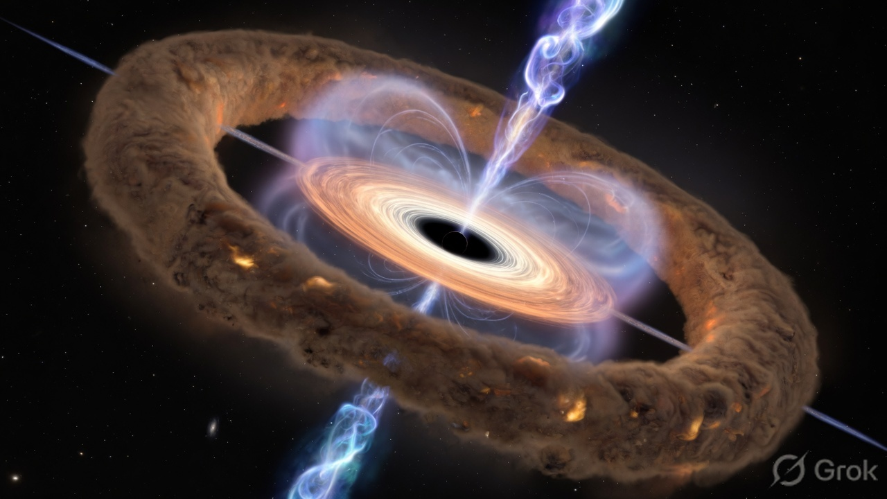
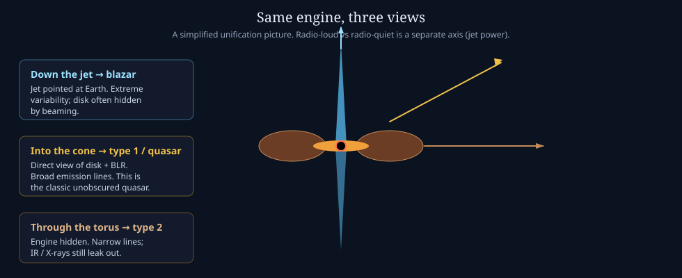

# Quasars

A **quasar** (originally *quasi-stellar radio source*) is a distant galaxy whose **core is so bright** that it can outshine the rest of the galaxy. The engine is a **supermassive black hole** accreting gas through a disk. Quasars are the high-luminosity end of **active galactic nuclei (AGN)**.

NASA’s compact statement of the same idea: they are distant galaxies whose cores are powered by supermassive black holes; luminosities can be tens to tens of thousands of times a Milky Way, generated in a region only light-days to light-years across.

*Teaching illustration: host galaxy, blazing nucleus, approaching (blue) and receding (red) jets, and outer lobes. Real jets need not be this symmetric or this well aligned with a spiral disk.*

## The one-sentence physics

Gas falls toward the SMBH → forms a disk → friction and magnetic stresses heat it → UV/optical continuum from the disk, X-rays from a hot **corona**, sometimes **jets** along the axis. The hole is the gravitational well. The *lamp* is the infalling gas.

Radiative efficiency is of order $0.1\,\dot{M}c^2$. A luminous quasar can swallow on the order of **a solar mass per year** (extreme objects more). That is enough to outshine $10^{12}$–$10^{14}$ Suns from a volume smaller than the solar system for the inner disk.

## Anatomy

| Piece | What it is | Typical light |
|-------|------------|----------------|
| SMBH | $10^7$–$10^{10}\,M_\odot$ | none from inside the horizon |
| Accretion disk | Orbiting gas; inner edge near ISCO | thermal UV / optical |
| Corona | Hot plasma above the inner disk | X-rays |
| BLR | Fast clouds at light-days | **broad** emission lines |
| Dusty torus | Donut of dust at parsec scales | infrared; can hide the BLR |
| NLR | Slower ionized gas at 10s–100s of pc | **narrow** lines |
| Jets | Magnetically collimated plasma | radio → γ-rays, depending on energy |

*Teaching illustration of the same engine, unlabeled.*

## AGN family (keep it small)

“Quasar” is a luminosity/class name, not a different machine.

| Name | Rough idea |
|------|------------|
| **Seyfert** | Nearby, lower-luminosity AGN; galaxy is easy to see |
| **Quasar** | Higher luminosity; at large distance the star-like nucleus dominates |
| **Radio galaxy** | Strong jets/lobes; nucleus may be obscured |
| **Blazar** | Jet aimed nearly at Earth; wildly variable |

**Type 1** vs **Type 2**: type 1 shows broad lines (direct view of BLR); type 2 does not (torus in the way). A common **unification** picture says these can be the same engine at different viewing angles. Jet power (radio-loud vs radio-quiet) is a second axis, not explained by angle alone.

## Why they look like stars, and why they are not

Early radio catalogs found objects that looked **stellar** on optical plates (hence *quasi-stellar*). Spectra showed huge **redshift**: they are cosmological. The first widely recognized example was **3C 273** (Schmidt, 1963). Nearest luminous quasars are still hundreds of millions of light-years away; many sit at redshift $z \sim 1$–$3$, when galaxies were gas-rich. That is why the local universe has few classic quasars — the fuel ran down — while leftover SMBHs remain in galaxy centers (the “dead quasar” / Soltan argument).

## Feedback

Disk winds and jets dump energy and momentum into the host. They can heat or expel gas and **quench** star formation, or, in some early phases, **compress** gas and help stars form. Either way, the tiny engine talks to the whole galaxy.

## Why X-rays (and later, XPoSat)

The **corona** and inner disk live at tens of gravitational radii. X-rays are produced there, and they **reflect** off the disk (iron Kα, Compton hump). Polarization encodes geometry: disk vs corona vs jet. That is the bridge from this wiki to XPoSat (POLIX polarimetry, XSPECT spectroscopy) in later notes.

Continue: [Black holes](black-holes.md) · [Glossary](glossary.md)
