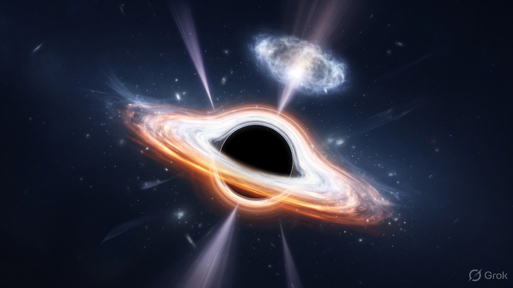
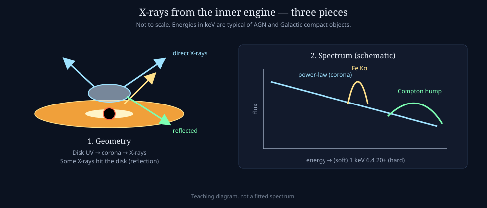
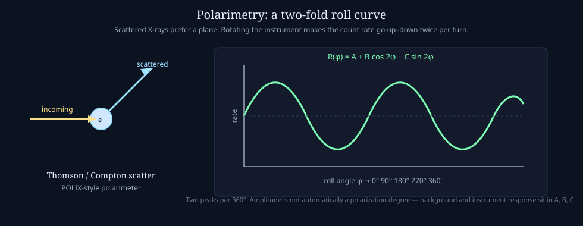

# X-ray astronomy

Enough X-ray vocabulary to read the [black hole](black-holes.md) / [quasar](quasars.md) pages and the XPoSat notes. Not a mission handbook.

X-rays here are photons of energy **~0.1–100 keV** (wavelengths of ångströms). Hot inner accretion flows can radiate X-rays directly, while energetic electrons can upscatter lower-energy seed photons into the X-ray band. Earth's atmosphere absorbs this band, so the telescope has to be in space.



*Teaching illustration: inner disk plus a compact hot corona. Not an observation.*

## Why compact objects shine in X-rays

Gravitational energy released near the [ISCO](glossary.md) becomes heat and radiation.

| Engine | Typical thermal peak | Where the X-rays come from |
|--------|----------------------|----------------------------|
| Stellar-mass black hole | ~keV (the disk itself can be X-ray hot) | Disk + corona |
| Neutron star | ~keV | Disk + surface or boundary layer; magnetic poles in some systems; corona |
| Supermassive (quasar / AGN) | UV / optical disk | A compact **corona** that upscatters disk photons; sometimes a jet |

For comparable Eddington-scaled accretion rates, a larger black hole has a cooler disk. That is why a Galactic binary and a quasar both belong in an X-ray mission, but their *thermal* peaks differ. Accreting neutron stars add emission from a surface or boundary layer ([NASA/HEASARC](https://heasarc.gsfc.nasa.gov/docs/nicer/science_nuggets/20250109.html)).

## Three spectral pieces



1. **Power-law continuum.** Disk UV/soft X-ray photons scatter off hot electrons in the corona (**inverse Compton**). The result is a roughly $N(E) \propto E^{-\Gamma}$ spectrum. $\Gamma \sim 1.7$–$2.0$ is a common AGN range; treat numbers as order of magnitude.
2. **Reflection.** Some coronal X-rays hit the disk. Iron fluorescence makes a line near **6.4 keV** (neutral Fe Kα; ionized gas shifts it). Compton down-scattering in optically thick disk material makes a broad **Compton hump** around ~20–30 keV.
3. **Soft excess / thermal disk.** Extra flux below ~1–2 keV. In stellar-mass systems this can be the disk itself; in AGN it is still debated.

For these spectral landmarks, see [Reynolds (2021)](https://doi.org/10.1038/s41550-020-01280-9); for the debated AGN soft excess, see [Sobolewska & Done (2007)](https://doi.org/10.1111/j.1365-2966.2006.11117.x).

**XSPECT** (~0.8–15 keV) sits on the power law, the iron band, and the soft end. **POLIX** (~8–30 keV) sits on the hard continuum and the Compton-hump region — useful for polarimetry of the scattering geometry ([ISRO](https://www.isro.gov.in/ISRO_EN/XPoSat_X-Ray_Polarimetry_Mission.html)).

## Polarimetry in one paragraph

Linear polarization is a preferred electric-field direction. Scattering polarizes; the sky-projected field encodes *geometry* (disk inclination, corona shape, jet order) that a spectrum alone mixes with optical depth and temperature.

A rotating scattering polarimeter records a count rate that varies **twice per 360° of roll**:

$$
R(\phi)=A+B\cos(2\phi)+C\sin(2\phi).
$$



The two-fold amplitude is a *modulation*. Polarization **degree** and **angle** need instrument response and a background that is accurately characterized and subtracted. POLIX background can itself have variable two-fold modulation. The Crab POLIX L2 `WeightedRoll` product in this repo is the modulation curve — the [handbook](../../literature/POLIX_User_Handbook.pdf) says it still mixes source and background, so it is not a polarization measurement.

## Units you will see in the files

| Word | Meaning here |
|------|----------------|
| **keV** | Photon energy. 1 keV ≈ 2.4×10¹⁷ Hz. |
| **PHA** | Pulse-height channel in the detector. Not energy until a response / calibration maps channel → keV. |
| **Soft / hard** | Roughly ≲2 keV vs ≳2–10 keV (usage varies). POLIX is hard X-ray polarimetry. |
| **Stokes Q, U** | Cartesian packaging of linear polarization. Degree $\sqrt{Q^2+U^2}/I$, angle $\tfrac12\operatorname{atan2}(U,Q)$. |
| **Modulation factor μ** | Instrument: how strongly a 100% polarized beam would two-fold modulate. PD ≈ (observed modulation) / μ after background. |
| **Crab** | Bright, persistent pulsar + nebula. Classic X-ray calibrator. Polarized; still not a free pass to skip background. |

## Why background dominates some products

X-ray detectors record events from source photons, cosmic X-ray background, particles, Earth albedo, and instrumental processes. For a bright point source the source can win. For faint AGN, or for a modulation measurement at the percent level, **source and background rates can be comparable**. Subtracting non-simultaneous “background” intervals is fragile if the particle environment changed. That is the limit documented in the Crab L2 quick-look.

## Bridge to this workspace

```
inner disk / corona / jet
        ↓
   X-ray spectrum (XSPECT)     X-ray polarization (POLIX)
        ↓                              ↓
   Γ, Fe Kα, reflection          geometry of the scatterers
```

Continue: [Quasars](quasars.md) · [Black holes](black-holes.md) · [Glossary](glossary.md)
